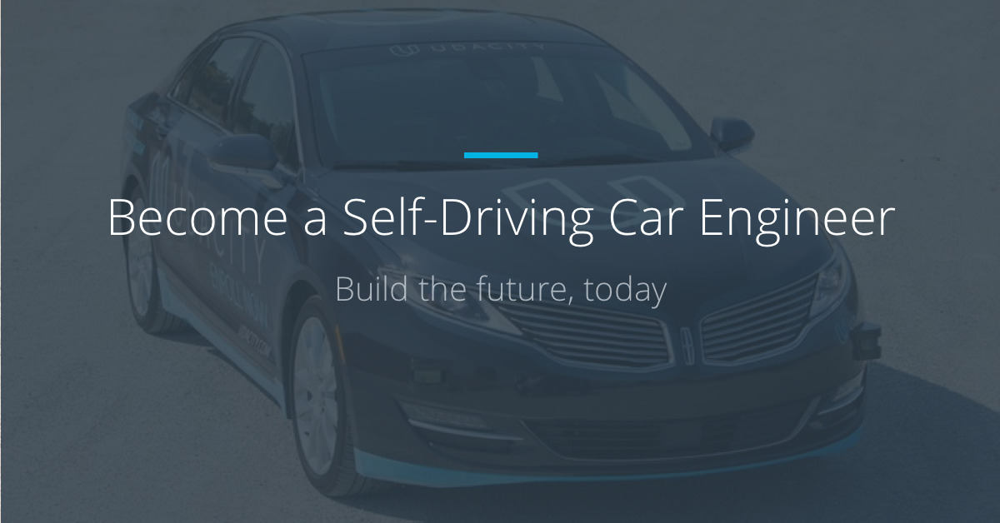

This is the project repo for the final project of the Udacity Self-Driving Car Nanodegree: Programming a Real Self-Driving Car. For more information about the project, see the project introduction [here](https://classroom.udacity.com/nanodegrees/nd013/parts/6047fe34-d93c-4f50-8336-b70ef10cb4b2/modules/e1a23b06-329a-4684-a717-ad476f0d8dff/lessons/462c933d-9f24-42d3-8bdc-a08a5fc866e4/concepts/5ab4b122-83e6-436d-850f-9f4d26627fd9).

| Pegasus member  | email | 
|:-----------------|:-------|
| Patrick Chiu |hereispatrick@gmail.com|
| Radhesh Bhat || 
| Gary Holness ||


### Environment
| Pegasus member  | email | 
|:-----------------|:-------|
| CPU |Intel i5 - 6 CPU|
| RAM |16G| 
| GPU | GTX 1060|
| OS | ubuntu 16.04|
| ROS |ROS Kinetic|
| CUDA | 9.0 |
| cuDNN | v7.2.1|

### Installation
##### Download via git
```bash
https://github.com/HereIsPatrick/CarND-Capstone-Pegasus.git
```

##### Install python dependence
```bash
cd CarND-Capstone-Pegasus
pip install -r requirements.txt
```

##### Download darknet_ros via git
```bash
cd ros/src
git clone --recursive https://github.com/leggedrobotics/darknet_ros.git
```
##### Patch darknet_ros (subscription image_color)
``` bash
cd darknet_ros
patch -p1 ../darknet_ros_yolo.patch
cd ../../
```

##### Make and run simulator
```bash
catkin_make
source devel/setup.sh
roslaunch launch/styx.launch
```

##### Make and run site
```bash
catkin_make
source devel/setup.sh
roslaunch launch/site.launch
```


## System Architecture Diagram
The following is a system architecture diagram showing the ROS nodes and topics used in the project. 


## Perception Subsystem
This capstone project that use car's camera to percept traffic light, feedback light state(Red,Yellow and Green) and nearest waypoint to system.

##### Use YOLOv3 to recognize traffic light
We choose YOLOv3 to recognize traffic light, because of real-time performance is better, We can get a easy for use ros node. YOLO ROS is created and maintain by Marko Bjelonic(Robotic Systems Lab, ETH Zurich), Based on the COCO dataset, YOLO can detect the 80 COCO object classes. The pre-trained model of the convolutional neural network is able to detect pre-trained classes including traffic light.

##### Darknet ROS

##### Traffic Light Detection Node

##### Traffic Light classifier

## Planning Subsystem
##### Subject 1
##### Subject 2
##### Subject 3

## Control Subsystem
##### Subject 1
##### Subject 2
##### Subject 3