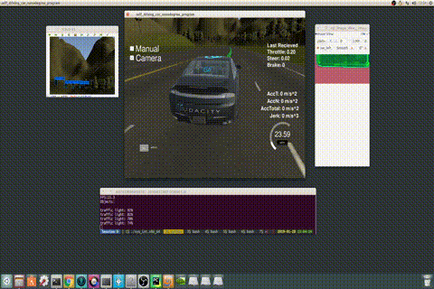
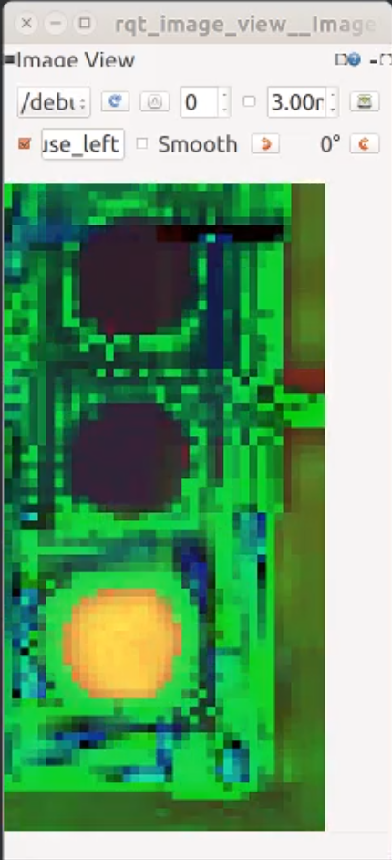
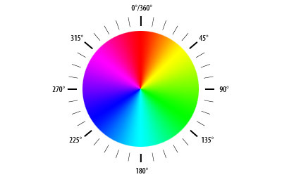
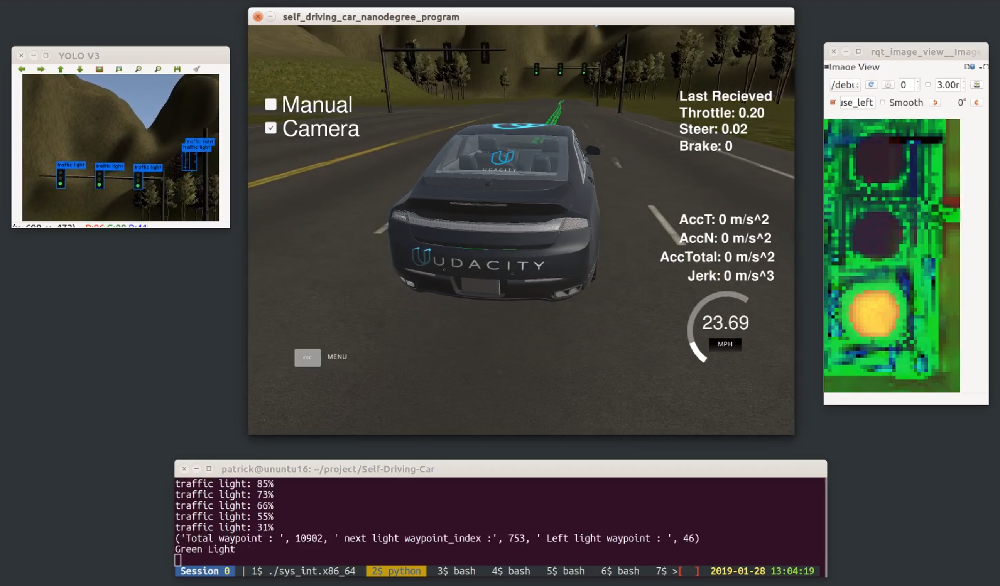
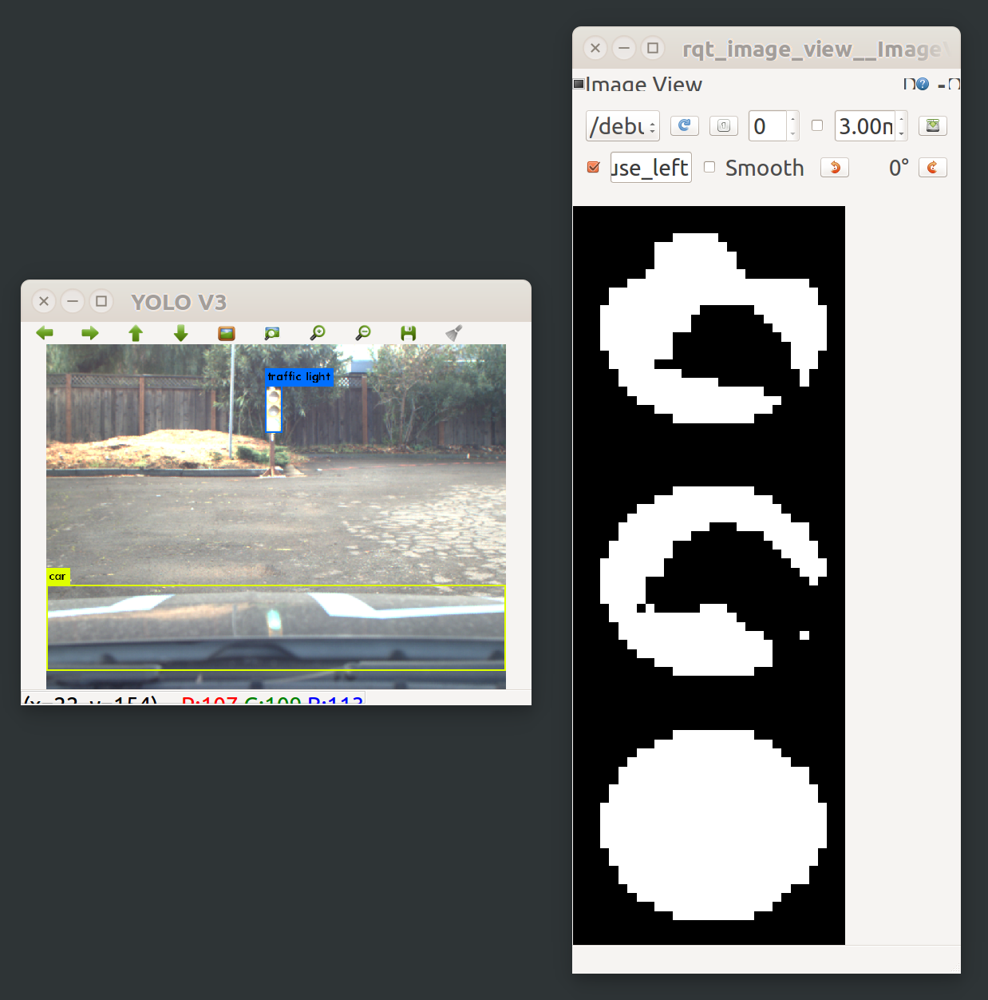

This is the project repo for the final project of the Udacity Self-Driving Car Nanodegree: Programming a Real Self-Driving Car. For more information about the project, see the project introduction [here](https://classroom.udacity.com/nanodegrees/nd013/parts/6047fe34-d93c-4f50-8336-b70ef10cb4b2/modules/e1a23b06-329a-4684-a717-ad476f0d8dff/lessons/462c933d-9f24-42d3-8bdc-a08a5fc866e4/concepts/5ab4b122-83e6-436d-850f-9f4d26627fd9).

| Pegasus member  | email | 
|:-----------------|:-------|
| Patrick Chiu (Leader) |hereispatrick@gmail.com|
| Radhesh Bhat |radheshbhat@gmail.com| 
| Gary Holness |gary.holness@gmail.com|




### Environment
| Item  | Detail | 
|:-----------------|:-------|
| CPU |Intel i5 - 8400|
| RAM |16G| 
| GPU | GTX 1060|
| OS | ubuntu 16.04|
| ROS |ROS Kinetic|
| CUDA | 9.0 |
| cuDNN | v7.2.1|

### Installation
##### Download via git
```bash
git clone https://github.com/HereIsPatrick/CarND-Capstone-Pegasus.git
```

##### Python( version 2.7.15 )
```bash
pyenv local 2.7.15
``` 

##### Install python dependence
```bash
cd CarND-Capstone-Pegasus
pip install -r requirements.txt
```

##### Download darknet_ros via git
```bash
cd ros/src
git clone --recursive https://github.com/leggedrobotics/darknet_ros.git
```
##### Patch darknet_ros (subscription image_color)
``` bash
cd darknet_ros
patch -p1 < ../darknet_ros_yolo.patch
cd ../../
```

##### Make and run (simulator mode)
```bash
catkin_make
source devel/setup.sh
roslaunch launch/styx.launch
```

##### Make and run (site mode)
```bash
catkin_make
source devel/setup.sh
roslaunch launch/site.launch
```

##### Debug with image view
If we want to check image status that we processed, we can launch rqt_image_view to subscribe topic /debug_traffic_light 
```bash
rqt_image_view
```




## System Architecture Diagram
The following is a system architecture diagram showing the ROS nodes and topics used in the project. 


## Perception Subsystem
This capstone project that use car's camera to percept traffic light, feedback light state(Red,Yellow and Green) and nearest waypoint to system.

##### Use YOLOv3 to recognize traffic light
We choose YOLOv3 to recognize traffic light, because of real-time performance is better, We can get a easy for use ros node. YOLO ROS is created and maintain by Marko Bjelonic(Robotic Systems Lab, ETH Zurich), Based on the COCO dataset, YOLO can detect the 80 COCO object classes. The pre-trained model of the convolutional neural network is able to detect pre-trained classes including traffic light.

##### Darknet ROS
YOLO ROS: Real-Time Object Detection for ROS is [here](https://github.com/leggedrobotics/darknet_ros/)
After clone darknet ros, change configuration of our darknet ros node, subscribe to /image_color.
Second change configuration of TLDetector node to subscribe boundingboxes

Bounding Box msg structure:

- string Class 
- float64 probability 
- int64 xmin 
- int64 ymin 
- int64 xmax 
- int64 ymax 


##### Traffic Light Detection Node
Subscribe image_color and /darnet_ros/bounding_boxes topic for Traffic Light Detection Node. 

We only process traffic light class, and probaility greater than 0.85 in simulator mode. 0.25 in site mode.

Check size of boundingbox, diagonal of boundingbox grater than 80 pixel in simulator mode. 40 pixel in site mode. we will handle it.

In simulator, we have waypoints, to calculate traffic light waypoint index and state.


##### Traffic Light classifier
We have two procedure for simulator and site mode.

------
In simulator mode, we convert image to hsv color space, filter by Red, Yello and Green color.

- Red : 0 ~ 20, 340 ~ 360 degree.
- Yello : 40 ~ 70 degree.
- Green : 90 ~ 140 degree.



```
        # Step. convert to hsv space.
        hsv_bb_img = cv2.cvtColor(bb_image, cv2.COLOR_BGR2HSV)

        # Reference from https://stackoverflow.com/questions/42882498/what-are-the-ranges-to-recognize-different-colors-in-rgb-space
        # Red color
        hsv_red1_range = cv2.inRange(hsv_bb_img, (0 / 360 * 255, 70, 50), (20/360 * 255, 255, 255))
        hsv_red2_range = cv2.inRange(hsv_bb_img, (340.0 / 360 * 255, 70, 50), (360.0/360 * 255, 255, 255))

        # Yellow color
        hsv_yellow_range = cv2.inRange(hsv_bb_img, (40.0 / 360 * 255, 100, 100), (70.0 / 360 * 255, 255, 255))

        # Green color
        hsv_green_range = cv2.inRange(hsv_bb_img, (90.0 / 360 * 255, 100, 100), (140.0 / 360 * 255, 255, 255))
        
```

We count it after filter, if count pixel greater than 50 pixel in the color.
we can make sure the light state.

```
        PIXEL_THRESHOLD = 50
        # Red range in hsv space that two region ,(0~20) and (340~360)degree.
        if (cv2.countNonZero(hsv_red1_range) + cv2.countNonZero(hsv_red2_range))/2 > PIXEL_THRESHOLD:
            print('Red Light')
            return TrafficLight.RED
        elif cv2.countNonZero(hsv_yellow_range) > PIXEL_THRESHOLD:
            print('Yellow Light')
            return TrafficLight.YELLOW
        elif cv2.countNonZero(hsv_green_range) > PIXEL_THRESHOLD:
            print('Green Light')
            return TrafficLight.GREEN
        else:
            print('Unknow')
            return TrafficLight.UNKNOWN

```





------

In site mode, we follow steps as below to get light state.

1. Partition traffic light image to 3 regions.
2. Convert it to grayscale image.
3. Filter it under grey threshold 210 to 255
4. Count pixel of each region
5. Get the light state base on maxium counting pixel of region. 

We can see below right image. maxium counting pixel of region is green light partition.
```
        s={}
        s[TrafficLight.RED]=red_count
        s[TrafficLight.YELLOW]=yellow_count
        s[TrafficLight.GREEN]=green_count

        # Step. get the light state that max pixel of region.
        state = max(s.iteritems(), key=operator.itemgetter(1))[0]

        if red_count==0 and yellow_count==0 and green_count==0:
            print("unknow")
            state = TrafficLight.UNKNOWN
        else:
            if state == TrafficLight.RED:
                print ('Red Light')
            elif state == TrafficLight.YELLOW:
                print ('Yellow Light')
            elif state == TrafficLight.GREEN:
                print ('Green Light')

        return state
```



## Planning Subsystem
The main purpose of waypoint updater is to publish next 200 waypoints which is ahead of the car. Depending on the current position of the car, waypoint updater finds nearest waypoint to the car. This node is also responsible for updating waypoint to decelerate when traffic light is detected. Based on the update from TL detector, we compute the distance from the closest waypoint to the car to two points before the stop waypoint. The two points before the stop line give us a buffer to stop. It then computes the distance to the stop location, and calculates the velocity accordingly.


## Control Subsystem
The Control Subsust consists of two major components.  These are the Waypoint Follower and
the Drive by Wire (DBW) components.  Our DBW implementation is found in the src/twist_controller
directory.  The DBW node consists of a PID controller, low pass filter, along with control 
logic presented as a ROS node, namely the DBW node.  Implementation focused on twist_controller.py
and dbw_node.py.   The DBW node subscribes to ROS topics

- /current_velocity
- /twist_cmd
- /vehicle/dbw_enabled

and publishes to ros topics

- /vehicle/throttle_cmd
- /vehicle/steering_cmd
- /vehicle/brake_cmd

#####  dbw_node.py
The DBW node publishes steering, throttle, and brake commands at 50Hz.  This is the frequency at which the system on Carla (Udacity Autonomous Car) expects messages, otherwise autonomy will disengage if control messages are published at less than 10Hz.  As Carla is an automatic vehicle, if no braking or throttle is applied, the car will roll forward.   The breaking force employed is 700 Nm of torque.  

Team members who tested in the simulator on a slower machine running simulator natively and ROS in a VM on virtual box found that the rate needed to be slowed to 10Hz to contend with a lag issue due to communications of published topics from the simulator overwhelming ROS.  This issue manifested when the camera was turned on in the simulator.  For the submitted version, the rate was set to 50Hz.

##### twist_controller.py
PID control parameters kp,ki,kd were set to kp=8.5, ki=0.005, and kd= 6.0.  A long cycle of testing and selecting parameters was performed.  This was done by successive doubling followed by fine adjustment after observation of resulting driving profile.  Observation was made that the highway driving contained long stretches of curved roadway resulting in large accumulated error.  For this reason, ki was selected to be relatively small.  Observation was also made that the roadway had wavy segments that approach quickly.  Mitigating navication in these segments warranted responsive derivative component.  For this reason, kd was set relatively large.   Lastly, the highway included agressive curved sections of roadway.   Navigating through this warranted a proportional response capable of keeping car in lane around such curves.  Therefore, the choice for kp was set high relative to the derivative constant.  The church lot course involved a very sharp turn that looped around in a tight space.  Examining the waypoints, the curve was both sharp and the difference between successive waypoints was quickly changing.  Again, the approrpriate settings was a larger proportional component, followed by somewhat smaller derivative component, and a small integral component.  The setting we arrived upon satisfied these
observtions.   

The resulting control parameters were tested on a relatively slow machine (update rate 10Hz to deal with lag) both on the highway course and the church lot course.   For both, the resulting controller successfully navigated the tracks exhausting all of the waypoints. These results were reproducable.

The cutoff frequency was tested at a number of settings.  This began fairly agressive with tau=0.03, 0.05, 0.2, and 0.5.  This was done in conjnction with increasing the maximum throttle value to 0.8.  Given the increased throttle value, a less agressive cutoff frequency of tau=0.5 gave best results.  This makes sense becase as velocity increases, so to does the frequency or rate of change in velocities because you may find the need to want to change rapidly.

##### Dealing with lag

When running ROS on the Ubuntu 16.04 Virtual Machine and the simulator natively, there was a serious issue with lag.  The issue concerns the simulator publishing topics to the ROS nodes on the VM faster than can be handled.  After many hours of investigation, information online points to the ROS messaging protocol. This issue arose when the camera was turned on in the simulation (highway).  A real fix would involve the ability to slow down the simulator's publish rate of Image messages to /image_color topic.  In lieu of that, addressing it included slowing down dbw_node.py rate to 10Hz and turning on tcp_nodelay=True in subscriptions for TwistStamped messages for /twist_cmd and /current_velocity topics.  When testing on a slower machine, these helped mitigate the lag issue.  The lag issue caused the car to oscillate and become uncontrollable because the control commands were out of synch with the state of the simulator due to ROS on the VM being overwhelmed messages published by the simulator.

#### Comparision parameter
Here is 2 set parameters for dbw.
- Parameter 1:
  - kp=8.5
  - ki=0.05
  - kd=6.0
  - mx=0.8
  - brake=700

- Parameter 2:
  - kp=0.3
  - ki=0.1
  - kd=0.0
  - mx=0.2
  - brake=400


We compare two set parameters as above.

Parameter 1 is too aggressive, maximum throttle is 0.8.
In real churchlot, Too fast speed could scare carla’s driver and stop our test.
On highway simulator, Parameter 1 makes throttle and brake change happen frequently.
And brake always in use.It’s not good for car.

Parameter 2 is stable than Parameter 1.

Eventually we choose Parameter 2. 

You can watch video as below link.(Left side is Parameter 1, Right side is Parameter 2)

[](https://youtu.be/A27kHtjJ0Y0
 "Comparsion Parameter")

## Result of Video
#### Simulator(Highway Time-lapse with music)
[](https://youtu.be/fiB9qJFm0lE
 "Simulator(Highway Time-lapse with music)")
 
#### Simulator(Highway full version)
[](https://youtu.be/tdR3GoSJLqA
 "Simulator(Highway full version)") 
 
#### Simulator(Churchlot)
[](https://youtu.be/4XgFrIKWlvM
 "Simulator(Churchlot)")

#### Churchlot traffic light training
[](https://youtu.be/mDkHKSULjNw
 "Churchlot traffic light training")


